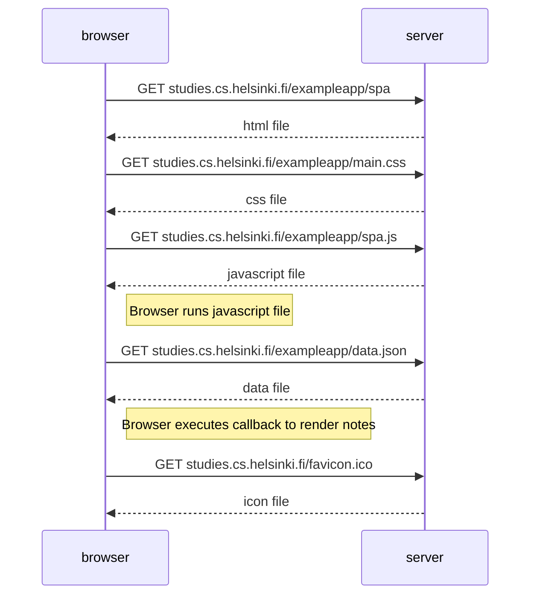

# Diagram for single page app

```mermaid
  sequenceDiagram
    participant browser
    participant server
  
    browser->>server: GET studies.cs.helsinki.fi/exampleapp/spa
    server-->>browser: html file
    
    browser->>server: GET studies.cs.helsinki.fi/exampleapp/main.css
    server-->>browser: css file
    
    browser->>server: GET studies.cs.helsinki.fi/exampleapp/spa.js
    server-->>browser: javascript file
    
    Note right of browser: Browser runs javascript file
    
    browser->>server: GET studies.cs.helsinki.fi/exampleapp/data.json
    server-->>browser: data file
    
    Note right of browser: Browser executes callback to render notes
    
    browser->>server: GET studies.cs.helsinki.fi/favicon.ico
    server-->>browser: icon file
    
```
